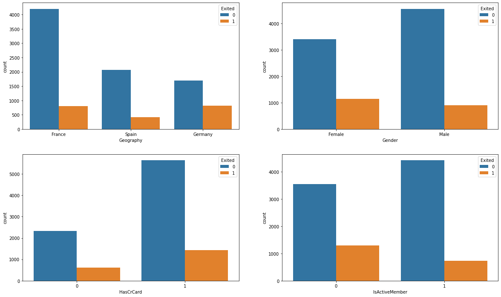

# Bank Customer Churn Prediction

## Table of Content
  * [Problem Statement](#problem-statement)
  * [Approach](#approach)
  * [Technologies Used](#technologies-used)
  * [Installation](#installation)
  * [Bugs & Logs](#bugs--logs)
  * [Contributors](#contributors)




## Problem Statement
In general, churn is expressed as a degree of customer inactivity or disengagement, observed over a given time. This manifests within the data in various forms such as the recency of account actions or change in the account balance

## Aim:
### We aim to accomplist the following for this study: 
Identify and visualize which factors contribute to customer churn:
### Build a prediction model that will perform the following:
Classify if a customer is going to churn or not

Preferably and based on model performance, choose a model that will attach a probability to the churn to make it easier for customer service to target low hanging fruits in their efforts to prevent churn

### We will be using ANN models and H2O Auto ML in this project


H2O is a fully open-source, distributed in-memory machine learning platform with linear scalability. H2O supports the most widely used statistical & machine learning algorithms, including gradient boosted machines, generalized linear models, deep learning, and many more.

## Approach
Data Exploration : I started exploring dataset using pandas,numpy,matplotlib and seaborn.

Data visualization : Ploted graphs to get insights about dependend and independed variables.

Feature Engineering : Removed missing values and created new features as per insights.

Model Building & Testing : Tried many machine learning algorithms and checked the base accuracy to find the best fit.


## Technologies Used
 
   1. Python 
   2. Sklearn
   3. Matplotlib
   4. ANN
   5. H2O AutoML
   6. Pandas, Numpy 

## Dataset
[Download here](https://github.com/hrishikeshkini/Bank-Customer-Churn-Prediction/blob/main/Churn_Modelling.csv)

## Installation
Click here to install [python](https://www.python.org/downloads/). To install the required packages and libraries, run this pip command in the project directory after cloning the repository:
```bash
git clone https://github.com/hrishikeshkini/Bank-Customer-Churn-Prediction.git
pip install -r requirements.txt
```
If pip is not already installed, Follow this [link](https://pip.pypa.io/en/stable/installation/)

## Bugs & Logs

1. If you find a bug, kindly open an issue and it will be addressed as early as possible. [Open](https://github.com/hrishikeshkini/Bank-Customer-Churn-Prediction/issues)
2. Under localhost, logging is performed for all the actions and its stored onto logs.txt file
3. When the app is deployed on heroku, logs can be viewed on  heroku dashboard or CLI.

## Contributors
  [Hrishikesh Kini](https://github.com/hrishikeshkini)


